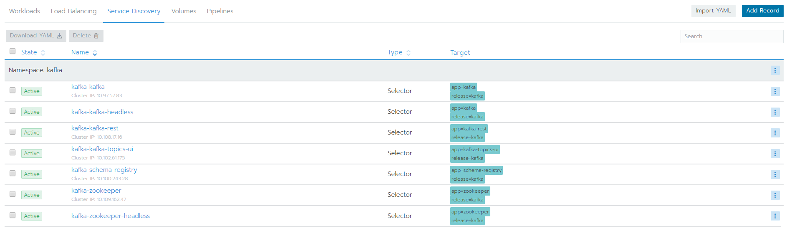

# docker kafka 集群环境搭建(3个 zookeeper 3个kafka)

## 单个物理机搭建集群

这种部署模式其实在生产时不会用到，只是为了在本地模拟多节点集群环境。 因为最终这些应用都是在同一台物理机上的。当这台物理机宕机后所有的节点都将宕机。
在实际生产中如果不使用 kubernetes 管理多主机大多数都是使用单节点 docker-compose-single-broker.yml 文件到多台物理机器上分别部署，这样才能实现高可用。

与单节点 kafka 模式唯一不同的是 docker-compose 文件不同。多节点 kafka [docker-compose.yml](https://raw.githubusercontent.com/yupengj/kafka-examples/master/docker-compose.yml)
执行方式与单节点的一样，在文件所在位置执行 `docker-compose up -d` 命令即可。使用 `docker-compose ps` 命令可以看到有6个容器，3个 zookeeper 3个kafka。
```sbtshell
$ jyp@jyp-linux:~/kafka$ docker-compose ps
     Name                   Command               State                          Ports                         
--------------------------------------------------------------------------------------------------------------
kafka_kafka1_1   start-kafka.sh                   Up      0.0.0.0:9091->9092/tcp                               
kafka_kafka2_1   start-kafka.sh                   Up      0.0.0.0:9092->9092/tcp                               
kafka_kafka3_1   start-kafka.sh                   Up      0.0.0.0:9093->9092/tcp                               
kafka_zoo1_1     /docker-entrypoint.sh zkSe ...   Up      0.0.0.0:2181->2181/tcp, 2888/tcp, 3888/tcp, 8080/tcp 
kafka_zoo2_1     /docker-entrypoint.sh zkSe ...   Up      0.0.0.0:2182->2181/tcp, 2888/tcp, 3888/tcp, 8080/tcp 
kafka_zoo3_1     /docker-entrypoint.sh zkSe ...   Up      0.0.0.0:2183->2181/tcp, 2888/tcp, 3888/tcp, 8080/tcp 
```

### 检查 zookeeper 集群

进入 kafka_zoo1_1 容器，执行 `./bin/zkServer.sh status` 命令查看 zoo 状态. kafka_zoo1_1 是 follower
```sbtshell
$ jyp@jyp-linux:~/kafka$ docker exec -it kafka_zoo2_1 /bin/bash
$ root@zoo1:/apache-zookeeper-3.5.5-bin# ./bin/zkServer.sh status
ZooKeeper JMX enabled by default
Using config: /conf/zoo.cfg
Client port found: 2181. Client address: localhost.
Mode: follower
```

进入 kafka_zoo2_1 容器，执行 `./bin/zkServer.sh status` 命令查看 zoo 状态. kafka_zoo2_1 也是 follower
```sbtshell
$ jyp@jyp-linux:~/kafka$ docker exec -it kafka_zoo2_1 /bin/bash
$ root@zoo2:/apache-zookeeper-3.5.5-bin# ./bin/zkServer.sh status
ZooKeeper JMX enabled by default
Using config: /conf/zoo.cfg
Client port found: 2181. Client address: localhost.
Mode: follower
```

进入 kafka_zoo3_1 容器，执行 `./bin/zkServer.sh status` 命令查看 zoo 状态. kafka_zoo3_1 是 leader
```sbtshell
$ jyp@jyp-linux:~/kafka$ docker exec -it kafka_zoo3_1 /bin/bash
$ root@zoo3:/apache-zookeeper-3.5.5-bin# ./bin/zkServer.sh status
ZooKeeper JMX enabled by default
Using config: /conf/zoo.cfg
Client port found: 2181. Client address: localhost.
Mode: leader
```

执行 `docker stop kafka_zoo3_1` 停掉 kafka_zoo3_1 容器。然后检查 kafka_zoo1_1 和 kafka_zoo2_1 zookeeper 状态。我这里查询出 kafka_zoo2_1 变为 leader。再次启动 kafka_zoo3_1 容器。检查其状态以变为 
follower 

### 检查 kafka 集群

kafka-manager 容器是 kafka 集群管理工具。在本地访问 192.68.1.4:9000(虚拟机ip),可以出现一个 kafka-manager web 界面。
- 然后点击 Cluster -> Add Cluster.在 Cluster 输入框中输入 test
- Cluster Zookeeper Hosts 中输入 `zoo1:2181,zoo2:2181,zoo3:2181` 
- brokerViewThreadPoolSize, offsetCacheThreadPoolSize, kafkaAdminClientThreadPoolSize 3个都是修改成 3。然后点击保存。保存后就可以看到kafka集群信息。

#### kafka-manager 可以干什么
- 管理多个集群
- 轻松检查群集状态（主题，消费者，偏移，代理，副本分发，分区分发）
- 运行首选副本选举
- 使用选项生成分区分配以选择要使用的代理
- 运行分区重新分配（基于生成的分配）
- 使用可选主题配置创建主题（0.8.1.1具有与0.8.2+不同的配置）
- 删除主题（仅支持0.8.2+并记住在代理配​​置中设置delete.topic.enable = true）
- 主题列表现在指示标记为删除的主题（仅支持0.8.2+）
- 批量生成多个主题的分区分配，并可选择要使用的代理
- 批量运行重新分配多个主题的分区
- 将分区添加到现有主题
- 更新现有主题的配置
- （可选）为代理级别和主题级别度量标准启用JMX轮询。
- （可选）过滤掉zookeeper中没有ids / owner /＆offsets /目录的使用者。

详细可参考： https://github.com/yahoo/kafka-manager


### 测试集群消息通道

```sbtshell
# 在 kafka_kafka1_1 容纳器中创建主题，并使用生产者控制台发送消息
kafka-topics.sh --create --topic test --zookeeper kafka_zoo1_1:2181,kafka_zoo2_1:2181,kafka_zoo3_1:2181 --replication-factor 3 --partitions 3
kafka-console-producer.sh --topic=test --broker-list kafka_kafka1_1:9092,kafka_kafka2_1:9092,kafka_kafka3_1:9092

# 在 kafka_kafka2_1 容纳器中创建消费者控制台，接收消息。
kafka-console-consumer.sh --bootstrap-server kafka_kafka1_1:9092,kafka_kafka2_1:9092,kafka_kafka3_1:9092 --from-beginning --topic test
```
> 经测试集群环境下使用控制台和java程序都可以发送和接收消息


## 多个物理机搭建集群(公司 kafka 集群环境)

公司 kafka 集群环境是使用 kubernetes 进行管理的。集群搭建是基于 kubernetes 应用市场以配置好的 kafka 集群环境，这里主要介绍如何使用

### kafka 集群暂时所有的服务



- kafka-kafka 是 kafka 集群(3个节点)向外公布的一个ip地址,与 kafka 集群通信都是通过这个地址
- kafka-zookeeper 是 zookeeper集群(3个节点)
- kafka-kafka-topics-ui 是 kafak topics 的查看页面可以传输的数据
- kafka-kafka-rest 为 kafka 集群提供RESTful接口

> 其他的几个现在不知道是做什么用的。

### 使用

- 需要 vpn 连接到 kubernetes 中 kafka 集群的10网段。(vpn会发到群里)
- 修改 java 生产者和消费者程序的 `ConsumerConfig.BOOTSTRAP_SERVERS_CONFIG` 配置，修改为 `10.97.57.83:9092`。启动两个程序就可以发送消息和接收消息了
- 查看 topics 访问 http://10.102.61.175:8000 地址会看到所有的 topics 信息。如果连接 kafka 集群测试建议 topics 以自己名称开始


